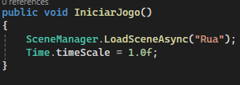
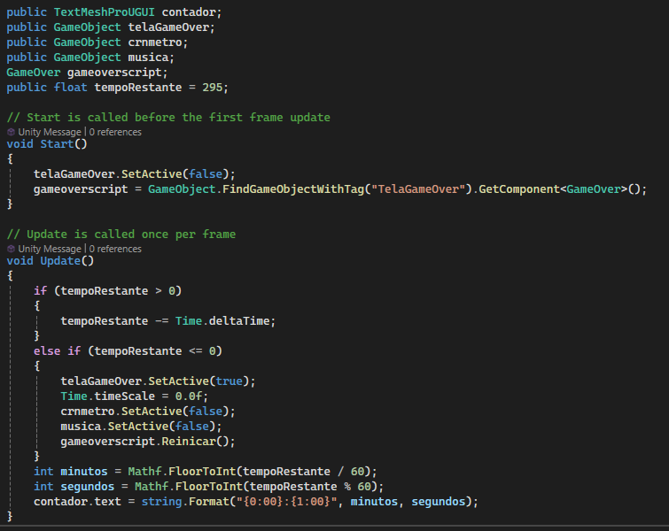
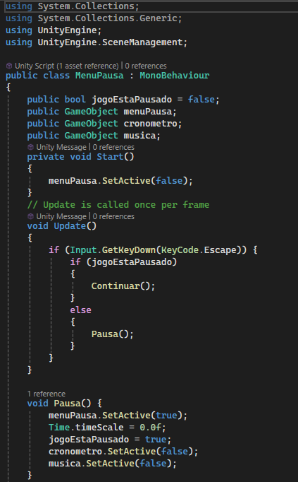
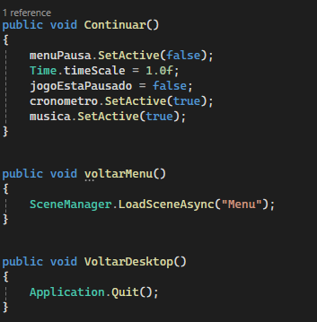

# Expresso_11
>[!Important]
 > ` - Projeto:`
>- Turma: 2°Mtec Desenvolvimento de Jogos Digitais.
>- Escola: Etec Prof. Basilides de Godoy.
>- Sobre: Repositório para a documentação do jogo Expresso 11, desenvolvido para a feira cultural da Etec Prof. Basilides de Godoy.
>- Datas: Gravar as fases (Quinta), entregar a documentação (Quinta), apresentação do jogo (Quinta).
>- Projeto (drive): https://drive.google.com/drive/u/0/folders/11AYAafGOKnD0kKMby2S_ybv2LrDbRA2h.

>[!Important]
 > ` - Equipe:`
>- Alex Campos de Oliveira
>- Christian Varandas
>- Guilherme Henrique
>- Igor Michelini

> [!NOTE]
 > `- Alterações do Jogo:`
>- `Script CriarCena (retirado)`: O CriarCena foi retirado devido a sua complexidade (na questão da codificação) e a falta de harmonia com outros scripts, logo, foi de preferência da nossa equipe montar as cenas a mão.
>- `Cena "Esgoto"  (retirado)`: Pela falta de tempo para desenvolver, arrumar e testar a cena Esgoto, a mesma foi retirada adjunto de seus inimigos (lizardman, um tipo de humano-reptil, e o rato).
>- `Ataque "Voadora"  (retirado)`: Devido aos problemas para fazer a animação funcionar e a criação de uma colisão para eliminar os inimigos ao ser utilizada, a voadora foi retirada do jogo.
>- `Timer (alterado)`: Anteriormente, era planejado para o timer se de 10 minutos e ter a mecânica de ser constante em ambas as cenas, ou seja, o timer final da cena "Rua" seria levado para a cena "Estação", mas devido a dificuldade para fazer isso e também pela decisão de retirar o script CriarCena, optamos por diminuir o timer para 5 minutos na "Rua" e 3 minutos na "Estação".
>- `Sobre nós (adicionado)`: Uma interface com fotos dos desenvolvedores do expresso 11 e com botões que levão para as contas do GitHub de cada um foi adicionada durante o projeto.

> [!NOTE]
>- `Gameplay`:

https://github.com/user-attachments/assets/10ab424d-d603-40bb-a4b7-0a90c57bcb2d

_________________________________________________________________________________________________________________________________ 

# História do Game:
-  Juninho da Silva Cleidson é alguém de origem humilde que mora com sua esposa, Alexandria, no Bairro Bom Retiro. Enquanto sua esposa, atualmente desempregada, está focada nas tarefas de casa, Juninho depende de seu emprego para pagar as despesas e trazer a comida. Outros personagens são os NPCs nas ruas, que serão obstáculos do protagonista. Estes, estão fazendo suas atividades diversas do dia a dia, mas infelizmente seu destino fica na direção oposta do de Juninho. 
 Certo dia, enquanto estava afundado em suas fantasias do sono, Juninho é acordado pelo temível som de seu despertador – “Já são 10:45”, a fatídica voz robótica do alarme se mostrou o suficiente para fazê-lo levantar em desespero, preparar as suas coisas às pressas e se retirar de casa com sua mochila, não conseguindo nem mesmo se despedir de Alexandria, pois a pontualidade em seu emprego é rígida. 
 Ele então parte de sua morada na direção da estação mais próxima na tentativa de chegar a tempo.
 
_________________________________________________________________________________________________________________________________ 

# Animações:
- As animações foram feitas utilizando-se de base dois vídeos do Youtube ( e ). Os modelos e animações, entretanto, foram pegos da Mixamo e extraídos para o Unity, assim tendo suas texturas carregadas e separadas por personagem e tipo (animações, personagens, etc). Para cada personagem e NPC, foi feito um controller e um animator (o animator oferecia uma interface para manipularmos as animações e o controller serve como uma forma de manipular a animação, como, por exemplo: criar um parâmetro que chame uma animação de corrida quando o valor for igual a três) para o carregamento da animação, é importante saber que isso foi feito, pois cada animação da Mixamo necessitava ser instalado com o modelo de personagem, também da Mixamo, que fosse ser colocada para assim funcionar no jogo. Outra coisa importante é que, as animações utilizadas no Expresso 11, foram retiradas do pacote que elas estão inicialmente com Ctrl + D (a imagem se assemelha a um triângulo azul). Com os controllers já criados, só foi necessário puxar as animações para o painel do controle e deixá-las como default (que no caso, já vem como padrão), assim tínhamos as animações.
 
_________________________________________________________________________________________________________________________________ 

# Colisões:
- As colisões de nosso jogo foram utilizadas, principalmente, para a criação do contato, diminuição do "timer" do personagem principal e para a destruição dos Npcs que colidissem (os inimigos do jogo), mas também utilizamos delas para fazer a troca de cenas e trazer o aumento do som da música do jogo. A princípio, foram-se feitos objetos vazios e só após isso, adicionadas as colisões (box collider) nesses objetos vazios (houve a necessidade de alterar as caixas de colisões deles), vale também ressaltar que essa tática foi utilizada somente para: a ação de trocar de cena e o aumento do som. Agora, para os Npcs do jogo foi somente adicionado um Box Collider nos modelos pré-separados para fazer a identificação da colisão e, no caso da destruição dos inimigos (clonados para a repetição dos mesmos), foi-se feito um código para deletá-los após ultrapassarem determinada distância no eixo X.
 
_________________________________________________________________________________________________________________________________ 

# Scripts:
- Os scripts criados para o jogo foram:
  
  1 - MenuPausa;
  
  2 - GameOver;
  
  3 - CriaCena;
  
  4 - Spawn;
  
  5 - Colisao;
  
  6 - cronometro;
  
  7 - Jogar;
  
  8 - Sobre;
  
  9 - TrocarCena;
  
  10 - MovCam;
  
  11 - MovNPC;
  
  12 - MovPers;
  
  13 - perfis;
  
  14 - ScriptCutsceneFinal;
  
  15 - ScriptFinal;
  
  16 - voltae;

 ## Mecânicas
 `Spawn`: O Spawn é colocado em um objeto vazio, fazendo-o se mover em zig-zag para a direita e spawnar de forma randômica os modelos separados previamente (nesse caso, estão em um objeto vazio chamado "Npcs"). Foi imposto um limite em que esse objeto vazio pode se locomover no eixo X, o parando quando se aproxima da estação e ainda sim mantendo o movimento de zig-zag e o spawn dos modelos.
   

 ## Movimentação 
  `MovCam`: É o código que tem a movimentação da câmera, a qual, segue o objeto selecionado que no caso do Expresso 11, é o "player".
  
 
  `MovNpc`: É a movimentação dos Npcs (inimigos) que se movem somente no eixo X para a esquerda. Não tem nada a mais, é somente uma movimentação constante para a esquerda e que, após ultrapassar determinada posição, deleta o determinado objeto.
  
 
  `movPers`: Tem a função de conter a movimentação do jogador, o qual pode ser mover para cima, baixo e pular (teclas, respectivamente: W, S, Space). Tem uma velocidade constante no eixo X, o qual aparece no eixo Z dentro do script devido à manipulação da rotação dos modelos da Mixamo (que é utilizado nos personagens e, como já é de se imaginar, no player também) que acabou por bugar um pouco os eixos.
 
## Colisão
 `Colisao`: É a colisão colocada nos Npcs para identificar quando houver contato com um gameobject de nome "player", caso ocorra esse contato, o objeto é destruído e o tempo do cronômetro é subtraído por 10 (diminue 10 segundos).

## Cenas
`Trocar_Cena`: Utilizando-se de um objeto vazio e um collider inserido nele, o script Trocar_cena identifica se houve alguma colisão com o collider do objeto vazio "TrocarCena" e se ocorrer, troca para a próxima cena posta previamente no objeto dentro do unity (é uma string pública).
  
_________________________________________________________________________________________________________________________________ 

# UI
`Menu`: O menu é uma cena separada, que carrega a cena "Rua" quando o jogador aperta no botão de jogar, utilizando do comando SceneManager.LoadSceneAsync("Rua"). Foram utilizados os componentes Text(TextMeshPro), Button e Panel. O menu Sobre Nós é um painel transparente (para manter o fundo do trem), sendo apenas ativado ao clique do botão, utilizando o comando SetActive(True).
 

`Cronometro`: O Cronometro é novamente feito com um Text - TextMeshPro, na aba do código é primeiro definido a quantidade de segundos para o jogo. Depois no método Update() é criada uma condição: Se tempoRestate > 0, diminua o tempo por deltaTime, isso faz com que o cronometro diminua em um valor constante, independente do quão potente é o computador, caso contrário, ele mostra a tela de derrota. Logo após isso, são criadas duas variáveis locais: minutos e segundos, que recebem o valor de tempoRestante em segundos e formatam usando divisão e módulo para o valor desejado. Após utilizar o comando String.Format para formatar e mostrar o tempo restante de uma forma melhor.
 

`Game Over`: É um painel transparente, sendo ativado a partir do script do cronômetro, quando o valor do tempoRestante chega a 0, é composto por um Text e um Button e um comando Time.timescale = 0.0f, para pausar o jogo completamenete. O botão tem o código SceneManager.LoadSceneAsync(SceneManager.GetActiveScene().name) que carrega a cena atual novamente.
 

`Menu de Pausa`: É um painel com três botões: Continuar, Voltar ao Menu e Voltar ao Desktop. Para pausar, é usado o comando Time.TimeScale = 0.0f, que deixa o jogo pausado, logo após, é carregado o menu de pausa com o SetActive(true). Para voltar ao menu, é utilizado o comando SceneManager.LoadSceneAsync("Menu"), para ir ao desktop, é utilizado o Application.Exit(), para continuar é apenas desativado o menu de pausa, e o valor do Time.timescale é colocado em 1, o qual é a velocidade padrão do jogo.

 

 

`Final`: Um painel preto, com os componentes Text e Button, com o Text descrevendo o que acontece no final e o botão contendo o código SceneManager.LoadSceneAsync("Menu"), para voltar ao menu.
 
_________________________________________________________________________________________________________________________________ 

# Cores
- Como podemos observar pelas imagens dos materiais utilizados no nosso projeto (em resumo, as cores que usamos para pintar o cenário e os móveis), predominantemente temos uma paleta de cores "fria", as quais além de transmitir a sensação de frio, também servem para transmitir a rotina desgastante de nosso protagonista. Em alguns casos, como a texturização de móveis ou objetos específicos, esse padrão se altera e utilizamos de cores mais claras e chamativas, mas no geral, o jogo utiliza de uma paleta mais puxada para o cinza, preto e branco.

`Rua`

 

`Estação`

 
_________________________________________________________________________________________________________________________________ 

# AssetStore e Criação de Cena:
- Alguns dos conjuntos de modelos 3D (ou em outras palavras, "Pacotes) abaixo não foram utilizados para a composição do cenário, sendo retirados devido à falta de outros modelos de texturas semelhantes para complementá-los, no entanto, conseguimos achar modelos de Polygon (modelos poligonais, meio quadrado) para ocupar essa espaço. Para a composição das cenas do jogo, os pacotes tiveram seus modelos separados em: "Organizado" e "Others", aonde uma continha os modelos separados em tipo (móveis, veículos, etc) e outro para manter os "pacotes" originais, ou seja, as pastas de cada conjunto da AssetStore. Outros modelos pegos, nesse caso os dos personagens e as animações de corrida, vieram da Mixamo e colocados em uma pasta chamada de "Personagens" que continha outras sub-pastas que separavam animações, os obstáculos (Npcs), as animações e os controllers de cada modelo (esses controllers servem para controlar a questão das animações de cada modelo). Por fim, também foram feitas pastas para guardar e deixar melhor organizado as texturas e os materiais utilizados, além de alguns modelos terem sido criados a mão com modelos de outros pacotes ou com os objetos do próprio Unity (é o caso da catraca).

## Referências:

https://assetstore.unity.com/packages/3d/props/shelves01-pack-289927

https://assetstore.unity.com/packages/3d/props/shelves01-pack-289927

https://assetstore.unity.com/packages/3d/props/simple-houses-pack-285349

https://assetstore.unity.com/packages/3d/props/simple-houses-pack-285349

https://assetstore.unity.com/packages/3d/environments/samhui-restaurant-282535

https://assetstore.unity.com/packages/3d/environments/samhui-restaurant-282535

 https://assetstore.unity.com/packages/3d/vehicles/land/korean-presidential-coach-279420

https://assetstore.unity.com/packages/3d/vehicles/land/korean-presidential-coach-279420

 https://assetstore.unity.com/packages/3d/environments/urban/low-polygon-house-277446
 
 https://assetstore.unity.com/packages/3d/environments/urban/low-polygon-house-277446

https://assetstore.unity.com/packages/3d/props/traffic-control-pack1-4919

https://assetstore.unity.com/packages/3d/props/traffic-control-pack1-4919

https://assetstore.unity.com/packages/3d/environments/urban/vrbn-studios-free-buildings-urp-bundle-001-264015

https://assetstore.unity.com/packages/3d/environments/urban/simple-cafe-258876

https://assetstore.unity.com/packages/3d/props/shelves01-pack-289927

https://assetstore.unity.com/packages/3d/props/shelves01-pack-289927

https://assetstore.unity.com/packages/3d/props/simple-houses-pack-285349

https://assetstore.unity.com/packages/3d/props/simple-houses-pack-285349

https://assetstore.unity.com/packages/3d/environments/samhui-restaurant-282535

https://assetstore.unity.com/packages/3d/environments/samhui-restaurant-282535

https://assetstore.unity.com/packages/3d/vehicles/land/korean-presidential-coach-279420

https://assetstore.unity.com/packages/3d/vehicles/land/korean-presidential-coach-279420

https://assetstore.unity.com/packages/3d/environments/urban/low-polygon-house-277446
 
https://assetstore.unity.com/packages/3d/environments/urban/low-polygon-house-277446

https://assetstore.unity.com/packages/3d/vehicles/simple-retro-car-291522

https://assetstore.unity.com/packages/3d/props/furniture/automatic-revolving-door-153549

https://assetstore.unity.com/packages/3d/environments/urban/simple-city-pack-plain-100348
